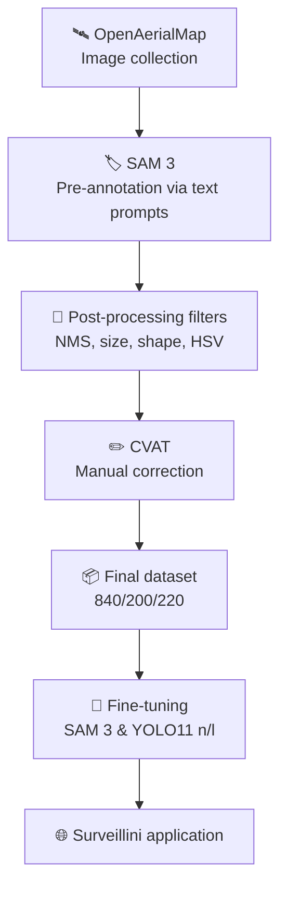

# 🚢 Instance Segmentation of Maritime Objects Using Deep Learning
> Career Preparation Project (P2M) — Higher School of Communication of Tunis (SUP'COM) — Academic Year: 2025/2026

## 📋 Description
This project proposes a complete processing pipeline for **maritime surveillance using deep learning**, from automated satellite image collection to the deployment of detection and segmentation models within a real-time web application (**Surveillini**).

The pipeline covers:
- 🛰️ **Automated collection** of satellite images via the OpenAerialMap API
- 🏷️ **Semi-automatic annotation** with SAM 3
- ✏️ **Manual correction** of annotations via CVAT
- 🧠 **Fine-tuning** of SAM 3 and YOLO11 (nano & large) on 8 maritime object classes
- 📊 **Comparative evaluation** (precision, recall, mIoU, mAP50, mAP50-95)
- 🌐 **Integration** into the Surveillini web application

## 👥 Authors
- Abbes Amir
- Harrabi Ines

## 🎓 Supervisors
- Mrs. Abdelkefi Fatma
- Mrs. Trabelsi Rim
- Mr. Cabani Adnane
- Mr. Lucas Justin Yirepoa Kinda

## 🏗️ Architecture du pipeline

## 🗂️ Maritime Object Classes
| Class |
|---|
| `sailboat` |
| `yacht` |
| `jet_ski` |
| `fishing_boat` |
| `cruise_ship` |
| `military_ship` |
| `tugboat` |
| `cargo_ship` |

## 📊 Dataset
- **1260 images** collected (port areas, multi-scale, via OpenAerialMap)
- Semi-automatic annotation (SAM 3) + manual correction (CVAT)
- Split: **Train (840) / Validation (200) / Test (220)**
- Format: PNG images + CVAT XML annotations (segmentation polygons)

📦 **The complete dataset is available via this link**: https://supcom-my.sharepoint.com/:f:/g/personal/amir_abbes_supcom_tn/IgDyzgE6X3UUQ45RmR51t0qvAVit7FN7Hh0Kqpf_QK6ll_M?e=e6WlBa

## 🧠 Trained Models
| Model | Task | mAP50-95 (Test) |
|---|---|---|
| SAM 3 (fine-tuned) | Instance segmentation | 0.809 (mIoU seg) |
| YOLO11n (without augmentation) | Detection | 0.246 |
| YOLO11n (with augmentation) | Detection | 0.326 |
| YOLO11l (with augmentation) | Detection | 0.389 |

> 📈 Total mAP50-95 improvement between the 1st and last YOLO experiment: **+58.1%**

## Results and new parameters:
This link takes you to a file containing the new weights obtained at the end of the fine-tuning phase: https://drive.google.com/file/d/1w3XW2gtmdcLUH3TAXct9jDZY0pvY4-Uw/view?usp=sharing

### 🔭 Future Directions
- Enriching the dataset for underrepresented classes (jet ski, sailboat, fishing boat)
- Exploring more recent models (YOLO26)
- Hybrid SAM 3 + YOLO11 pipeline (segmentation accuracy + detection speed)

*SUP'COM — University of Carthage — Academic Year: 2025/2026*
